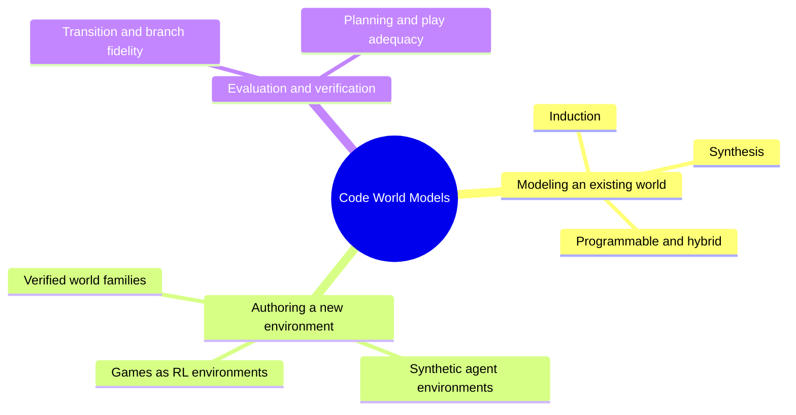

# Awesome Code World Models 

Executable, programmatic, and programmable world models: those whose state, dynamics, observation process, reward, or constraints are represented or executed, at least in part, as explicit programs.

The test is whether code participates in modeling the world, not whether a coding agent wrote the software, so Python simulators, DSLs, database-backed environments, physics scripts, and code dynamics paired with a neural renderer all qualify while ordinary coding agents and prompt-to-game generators do not.

Sections answer one question: what role does code play with respect to the world. How the program is acquired and updated, what is observable, and what it is used for are [tags](#tags) instead, so a paper appears exactly once and a robotics or 3D code world model arriving next year needs new tags rather than a new taxonomy.

## Contents

- [Overview](#overview)
- [World Model Induction](#world-model-induction)
- [World Model Synthesis](#world-model-synthesis)
- [Programmable and Hybrid World Models](#programmable-and-hybrid-world-models)
- [Executable Environment Generation](#executable-environment-generation)
- [Evaluation, Verification, and Benchmarks](#evaluation-verification-and-benchmarks)
- [Tags](#tags)
- [Models, Datasets, and Code](#models-datasets-and-code)
- [Related Resources](#related-resources)

## Overview

A world model has to answer what happens next. Learned models answer it with weights: dynamics live in activations or in a history of frames, where they cannot be read, edited, or checked against evidence. The consequences show up as drift over long horizons and as entities that stop existing once the camera turns away. Writing the dynamics as a program moves that knowledge into an artifact a person can inspect and a machine can execute exactly, which also makes it cheap. Rolling out a program instead of querying a language model as the world model is four to six orders of magnitude faster, and learning one can take thousands of times fewer environment interactions than deep reinforcement learning.

Where the program comes from splits the field, and what the split is really about is failure modes. Induction has to recover rules it was never shown and can silently omit one; synthesis is handed the rules and inherits whatever the specification left out. The first is the main line and the fullest section here.

Choosing code as the representation costs you the gradient. A program is discrete, so the prediction loss that fits a neural model has nothing to descend, and the optimizer becomes execution instead: propose a program, run it against recorded transitions, turn each mismatch into a counterexample, and repair. The exact comparison varies with what is observable, from matching transitions outright, to scoring observation likelihood under a model's own beliefs, to fitting parameters under multi-step rollout loss. What it buys back is a check no learned model offers, since a program can be required to reproduce every transition seen so far rather than approximate them, strict enough to gate an agent's actions until it does.

Code is precise about state and useless at pixels, which is why the hybrid branch stops asking it to draw anything. A program owns the persistent world state and its rules, compiles that state into an intermediate representation, and hands rendering to a pretrained video model. Both halves then do what they are good at: the program guarantees that the door is locked and the off-screen character still exists, and the generative model makes the frame look real.

The open problems are not where the early work expected. Recovering transitions turned out to be the tractable part; inferring what the agent is supposed to achieve is harder. Verification is its own trap, since a model can pass a sampling gate at full transition accuracy and still lose systematically when the fraction it gets wrong is the pivotal rule. Fidelity and utility can pull apart, because predicting observations more faithfully may cost exactly the distinctions a planner needs between actions. Coverage remains narrow, with strong results on grids, Atari, and board games, and much weaker ones on contact-rich physics and open real-world scenes. And once programs become cheap to write, the boundary blurs between modeling an environment and authoring one.

## World Model Induction

The world already exists and the agent must reverse engineer it: observations and trajectories in, executable dynamics out.

- **Code-as-World**: "Code as Worlds: Agentic Discovery of Executable World Representations for Physical Reasoning", *arXiv, Aug 2026*. [[Paper](https://arxiv.org/abs/2608.27549)] `standalone-sim` `offline` `pixels` `physical`
- **Twin**: "Twin: Playing an Unknown Game with a Test-Time Digital Twin", *arXiv, Aug 2026*. [[Paper](https://arxiv.org/abs/2608.14490)] [[Code](https://github.com/Alexyskoutnev/TWIN-ARC-AGI-3)] [[Website](https://arc-agi-3-twin.vercel.app/)] `standalone-sim` `test-time` `counterexample-repair` `planning` `games`
- **VisualPatchWorld**: "VisualPatchWorld: Code World Models as Latent Structured Representations for Planning", *arXiv, Jul 2026*. [[Paper](https://arxiv.org/abs/2607.25236)] [[Code](https://github.com/HKBU-KnowComp/VisualPatchWorld)] `sketch+params` `partial-obs` `planning` `robotics`
- **Agentic Real2Sim**: "Agentic Real2Sim: Physics-based World Modeling with Vision-Language Agents", *arXiv, Jul 2026*. [[Paper](https://arxiv.org/abs/2607.19190)] [[Website](https://agentic-real2sim.github.io/)] `standalone-sim` `offline` `pixels` `robotics`
- **Mind-Studio**: "Mind-Studio: Executable World Models with Lookahead Evaluation for Partially Observable Games", *arXiv, Jun 2026*. [[Paper](https://arxiv.org/abs/2606.16070)] [[Code](https://github.com/HKBU-KnowComp/MindStudio)] `standalone-sim` `partial-obs` `pixels` `planning` `games`
- **PatchWorld**: "PatchWorld: Gradient-Free Optimization of Executable World Models for Agent Environments", *arXiv, May 2026*. [[Paper](https://arxiv.org/abs/2605.30880)] [[Code](https://github.com/HKBU-KnowComp/PatchWorld)] `transition-fn` `partial-obs` `counterexample-repair` `text` `agents`
- **Pinductor**: "Learning POMDP World Models from Observations with Language-Model Priors", *arXiv, May 2026*. [[Paper](https://arxiv.org/abs/2605.13740)] `transition-fn` `partial-obs` `planning`
- **PoE-World**: "PoE-World: Compositional World Modeling with Products of Programmatic Experts", *NeurIPS, Dec 2025*. [[Paper](https://arxiv.org/abs/2505.10819)] [[Code](https://github.com/topwasu/poe-world)] [[Website](https://topwasu.github.io/poe-world)] `experts` `partial-obs` `pixels` `planning` `games`
- **GIF-MCTS**: "Generating Code World Models with Large Language Models Guided by Monte Carlo Tree Search", *NeurIPS, Dec 2024*. [[Paper](https://arxiv.org/abs/2405.15383)] [[Code](https://github.com/nicoladainese96/code-world-models)] `transition-fn` `offline` `full-state` `planning`
- **WorldCoder**: "WorldCoder, a Model-Based LLM Agent: Building World Models by Writing Code and Interacting with the Environment", *NeurIPS, Dec 2024*. [[Paper](https://arxiv.org/abs/2402.12275)] [[Code](https://github.com/haotang1995/WorldCoder)] [[Website](https://haotang1995.github.io/projects/worldcoder)] `transition-fn` `full-state` `self-evolving` `planning` `agents`

## World Model Synthesis

The dynamics are already stated in rules or a specification, and the work is compiling them into an executable model a planner can search.

- **CWM-GGP**: "Code World Models for General Game Playing", *ICLR, Apr 2026*. [[Paper](https://arxiv.org/abs/2510.04542)] `transition-fn` `partial-obs` `planning` `games`

## Programmable and Hybrid World Models

Explicit program state carries the world; a neural model supplies the observations.

- **PWM**: "Programmable World Model", *arXiv, Sep 2026*. [[Paper](https://arxiv.org/abs/2609.10540)] [[Code](https://github.com/AlayaLab/pwm)] [[Website](https://alaya-lab.github.io/pwm/)] `state+renderer` `video` `rendering` `games`
- **CWM**: "Code World Model: Coding Agent as World Brain", *arXiv, Aug 2026*. [[Paper](https://arxiv.org/abs/2608.25927)] [[Code](https://github.com/buaacyw/code-world-model)] [[Website](https://buaacyw.github.io/cwm/)] `state+renderer` `video` `rendering`

## Executable Environment Generation

Adjacent rather than core: the program is a new world written from a prompt or a corpus, not a model of one that already exists.

- **World-Time Compute**: "World-Time Compute with Verified Code World Models", *arXiv, Sep 2026*. [[Paper](https://arxiv.org/abs/2609.09163)] `standalone-sim` `symbolic` `rl`
- **PlayTrain**: "PlayTrain: An Efficient Reinforcement Learning Framework for LLM-Generated Adaptable JavaScript Games", *arXiv, Sep 2026*. [[Paper](https://arxiv.org/abs/2609.09059)] [[Website](https://playtrain.org/)] `standalone-sim` `pixels` `rl` `games`
- **SPADE**: "SPADE: Self-Play in Adaptive Synthetic Executable Environments", *arXiv, Aug 2026*. [[Paper](https://arxiv.org/abs/2608.19197)] [[Code](https://github.com/spade-rl/spade)] `standalone-sim` `self-evolving` `text` `rl` `agents`
- **AWM**: "Agent World Model: Infinity Synthetic Environments for Agentic Reinforcement Learning", *ICML, Jul 2026*. [[Paper](https://arxiv.org/abs/2602.10090)] [[Code](https://github.com/Snowflake-Labs/agent-world-model)] [[HF](https://huggingface.co/collections/Snowflake/agent-world-model)] `database-env` `text` `rl` `agents`

## Evaluation, Verification, and Benchmarks

Being executable makes a world model checkable, and also makes it easy to check the wrong thing.

- **Play-Adequacy**: "When a Verified World Model Still Loses: Play-Adequacy vs Prediction-Accuracy in LLM-Synthesized Code World Models", *arXiv, Jul 2026*. [[Paper](https://arxiv.org/abs/2607.14169)] [[Code](https://github.com/JaviMaligno/code-world-models)] `planning` `full-state` `games`
- **ScratchWorld**: "ScratchWorld: Evaluating If World Models Compute Executable Consequences", *arXiv, Jun 2026*. [[Paper](https://arxiv.org/abs/2606.31689)] `standalone-sim` `symbolic` `partial-obs`
- **WorldCoder-Bench**: "WorldCoder-Bench: Benchmarking Physically Grounded 3D World Synthesis", *arXiv, Jun 2026*. [[Paper](https://arxiv.org/abs/2606.01869)] `standalone-sim` `3d` `rendering`
- **CombatStateBench** - Count and state accuracy for programmable world models under long-horizon interactive generation. *From PWM, Sep 2026*. [[Paper](https://arxiv.org/abs/2609.10540)] [[Code](https://github.com/AlayaLab/pwm)]
- **CWMB** - Eighteen RL environments with text descriptions and curated trajectories for synthesizing and evaluating code world models. *From GIF-MCTS, Dec 2024*. [[Paper](https://arxiv.org/abs/2405.15383)] [[Code](https://github.com/nicoladainese96/code-world-models)]

## Tags

A fixed vocabulary, so entries stay comparable as the list grows; see [contributing.md](contributing.md) before adding one.

- Representation: `transition-fn` `experts` `sketch+params` `standalone-sim` `state+renderer` `database-env`
- Update regime: `offline` `test-time` `counterexample-repair` `self-evolving`
- Observability: `full-state` `partial-obs`
- Modality: `symbolic` `text` `pixels` `video` `3d`
- Usage: `planning` `rl` `rendering`
- Domain: `games` `agents` `robotics` `physical`

## Models, Datasets, and Code

- **SPADE Checkpoints** - Self-play checkpoints at 4B, 8B, and 30B-A3B together with the generated environment corpora. *From SPADE, Aug 2026*. [[HF](https://huggingface.co/spade-rl)] [[Code](https://github.com/spade-rl/spade)]
- **CWM Release** - Inference code, MiniMax-H3 LoRA checkpoints, and forty NPZ conditioning examples for the video realization path. *From CWM, Aug 2026*. [[Code](https://github.com/buaacyw/code-world-model)] [[Weights](https://huggingface.co/NTU-yiwen/awm-minimax-h3-new1344-lora-checkpoints)] [[Data](https://huggingface.co/datasets/NTU-yiwen/code-world-model-inference-examples-40)]
- **AgentWorldModel-1K** - One thousand executable, SQL-backed tool-use environments for multi-turn agent RL. *From AWM, Jul 2026*. [[HF](https://huggingface.co/datasets/Snowflake/AgentWorldModel-1K)] [[Code](https://github.com/Snowflake-Labs/agent-world-model)]

## Related Resources

Neighbouring work that does not fit the scope. Meta CWM shares the abbreviation but studies world models for code, not code as a world model.

- **Meta CWM**: "CWM: An Open-Weights LLM for Research on Code Generation with World Models", *arXiv, Oct 2025*. [[Paper](https://arxiv.org/abs/2510.02387)] [[Code](https://github.com/facebookresearch/cwm)] [[Website](https://ai.meta.com/research/publications/cwm/)]
- **Awesome World Models** - Broader papers on video, embodied, and driving world models. [[GitHub](https://github.com/leofan90/Awesome-World-Models)]

## Contributing

See [contributing.md](contributing.md).
